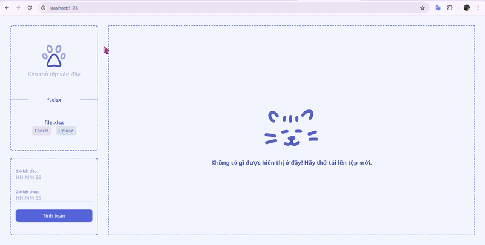

[Return to README.md](https://github.com/ume-meu/shub-test/blob/main/README.md)

<div align="left">
  
</div>

## 📊 Data Report Web App

This project is a simple web application that allows users to upload an `.xlsx` file, specify a time range, and calculate the total amount from the report file within the selected time range. It is built with React for the frontend and Go Fiber for the backend.

<div align ="left">
    
</div>

### ✨ Features

- **📂 File Upload:** Drag, drop, or upload an `.xlsx` report file.
- **🕒 Time Query:** Input start and end time for the data query.
- **📋 Data Display:** A table shows the report data from the uploaded file.

### 🛠 Technologies Used

- **Frontend:** React, Vite
- **Backend:** Go, Fiber, Air

### 🚀 Installation

#### 🖥 Backend (Go Fiber)

1. Install the necessary Go packages:
   ```bash
   go get github.com/gofiber/fiber/v2
   go get github.com/xuri/excelize/v2
   go get github.com/gofiber/fiber/v2/middleware/cors
   ```

2. Install the latest version of Air:
   ```bash
   go install github.com/air-verse/air@latest
   ```

3. Run the backend server:
   ```bash
   air
   ```

#### 💻 Frontend (React)

1. Create a new Vite project:
   ```bash
   npm create vite@latest note-app
   ```

2. Install dependencies:
   ```bash
   cd note-app
   npm install
   npm install react-router-dom react-icons react-modal axios moment
   ```

3. Run the frontend:
   ```bash
   npm run dev
   ```

### 🎯 Usage

1. **📂 Upload** an `.xlsx` report file via drag, drop, or by selecting the file.
2. **🕒 Input** the start and end times.
3. **📋 View** the data from the uploaded file in the table.
