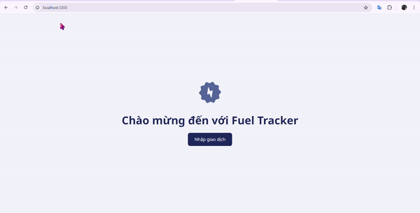

[Return to README.md](https://github.com/ume-meu/shub-test/blob/main/README.md)

<div align="left">
  
</div>

## ⛽ Fuel Tracker Form

This project is a web-based form for entering fuel transactions at a gas station. It is built using Next.js, with fields for transaction time, quantity, pump number, revenue, and unit price. The form validates user inputs and displays error or success messages based on the input.

<div align ="left">
    
</div>

### ✨ Features

- **🗓️ Transaction Time:** Date and time picker for the transaction.
- **⛽ Quantity:** Input field for the number of liters.
- **🚧 Pump Number:** Dropdown (select) field for the pump number.
- **💰 Revenue:** Input field for the total revenue.
- **🏷️ Unit Price:** Input field for the price per liter.
- **🛠️ Validation:** Automatic validation of the form fields, with error and success messages.

### 🛠 Technologies Used

- **Frontend:** Next.js

### 🚀 Installation

1. Install dependencies:
   ```bash
   npm install react-icons
   ```

3. Run the frontend:
   ```bash
   npm run dev
   ```

### 🎯 Usage

1. **🗓️ Select** the transaction time using the date-time picker.
2. **⛽ Input** the number of liters and select the pump number.
3. **💰 Input** the total revenue and the unit price.
4. **✅ Validate** the form by clicking "Cập nhật" (Update). The form will display error messages for missing or incorrect data and a success message if all fields are correct.
